# NeoEduCore — Diagramas del sistema

**Generado el 8 de agosto de 2026, desde el código de la rama `Darwin`.**

> Estos diagramas describen el **sistema construido**, no el diseño previsto. Se derivan de
> `database/sql/01_schema.sql` (artefacto de `pg_dump` contra producción), `routes/api.php`,
> `app/Models/`, `app/Services/` y `app/Http/Controllers/`. Cuando el informe del TFG y esto
> no coincidan, manda esto: las divergencias están inventariadas en
> [`ANALISIS_MODELO_DATOS_TFG.md`](ANALISIS_MODELO_DATOS_TFG.md) §10.
>
> **Para el informe.** Cubren las figuras 2 a 10 del índice de figuras y añaden el modelo
> entidad-relación, que el documento no tiene (§9.2 de aquel análisis).

## Cómo se trabaja con este documento

**Este `.md` es la fuente.** Los diagramas se escriben aquí una sola vez, en Mermaid.

**Para verlos en grande hay una versión HTML**, con cada figura a ancho completo, zoom y
pantalla completa:

```bash
php artisan diagramas:html      # genera docs/diagramas.html
```

`docs/diagramas.html` es un **artefacto derivado**, igual que `api-docs.json` o la colección
de Postman: si se edita a mano, se pierde en la siguiente ejecución. Existe porque en la
columna de texto Mermaid encoge el SVG para que quepa, y un ERD o un diagrama de clases se
vuelve ilegible; la página los saca del flujo y les da desplazamiento y zoom.

**Validación.** Los diagramas se comprueban con el parser real de Mermaid, sin navegador:

```bash
npm i mermaid jsdom
node validar.mjs docs/DIAGRAMAS.md
```

> En Node 24 `globalThis.navigator` solo tiene *getter*, así que el JSDOM se inyecta con
> `Object.defineProperty`, no con una asignación directa.

Si cambia el esquema, las cifras de la §1 se recomprueban con:

```bash
grep -c "ADD CONSTRAINT .* FOREIGN KEY" database/sql/01_schema.sql   # 51
grep -c "^CREATE TABLE public\."        database/sql/01_schema.sql   # 25 (20 dominio + 5 framework)
```

---

## Índice

1. [Modelo entidad-relación](#1-modelo-entidad-relación) — [mapa](#11-mapa-de-relaciones) · [personas](#12-personas-y-estructura-académica) · [evaluación](#13-evaluación) · [seguimiento](#14-seguimiento-tutor-ia-y-apoyo)
2. [Aislamiento multi-tenant](#2-aislamiento-multi-tenant)
3. [Diagrama de clases](#3-diagrama-de-clases) — [personas y traits](#31-personas-estructura-y-los-traits-de-seguridad) · [evaluación](#32-evaluación) · [seguimiento e IA](#33-seguimiento-ia-y-apoyo)
4. [Arquitectura del backend](#4-arquitectura-del-backend)
5. [Flujo de autenticación](#5-flujo-de-autenticación)
6. [Flujo de examen](#6-flujo-de-examen)
7. [Flujo del tutor IA](#7-flujo-del-tutor-ia)
8. [Diagrama de casos de uso](#8-diagrama-de-casos-de-uso)
9. [Diagrama de proceso: el ciclo académico](#9-diagrama-de-proceso-el-ciclo-académico)

---

## 1. Modelo entidad-relación

**20 tablas de dominio** — 15 entidades y 5 pivotes — con **51 claves foráneas**. Aparte
quedan 5 tablas de framework (`migrations`, `jobs`, `failed_jobs`, `password_reset_tokens`,
`personal_access_tokens`), que no son del dominio.

Va en **cuatro vistas**, y no por capricho de maquetación: un ERD de 20 entidades con todos
sus atributos es ilegible a cualquier tamaño. La §1.1 da la forma completa del modelo; las
§1.2 a §1.4 entran al detalle por área. Entre las tres detalladas están las 20 tablas, sin
repetir ninguna.

En las cuatro **se omiten las aristas de `institution_id`**: las lleva *toda* tabla de dominio
y saturarían la figura. Van en la [§2](#2-aislamiento-multi-tenant), que es donde además
significan algo.

### 1.1 Mapa de relaciones

La forma completa del modelo, sin atributos. Es la figura para el informe cuando hace falta
enseñar el conjunto de un vistazo.

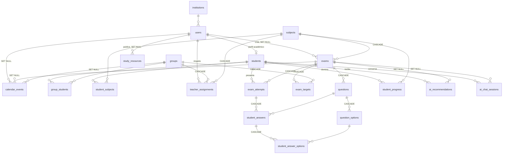

### 1.2 Personas y estructura académica

Quién es quién y cómo se agrupa. Las **tres** tablas pivote de aquí sostienen el ciclo
académico: la pertenencia a un grupo, la matrícula en materias y —desde el 08/08/2026— la
asignación del profesorado.

> **`teacher_assignments` es la pieza que hay que leer con atención.** Es la única fuente de
> la relación docente↔estudiante: «mis estudiantes» son los de los grupos que tengo
> asignados, y solo en las materias que imparto. Antes esa relación **no existía en el
> modelo** y el sistema la inferían de quién había creado cada examen, lo que permitía a un
> docente ampliarse el alcance solo. Ver §1.3 y la nota de decisiones al final de la §1.

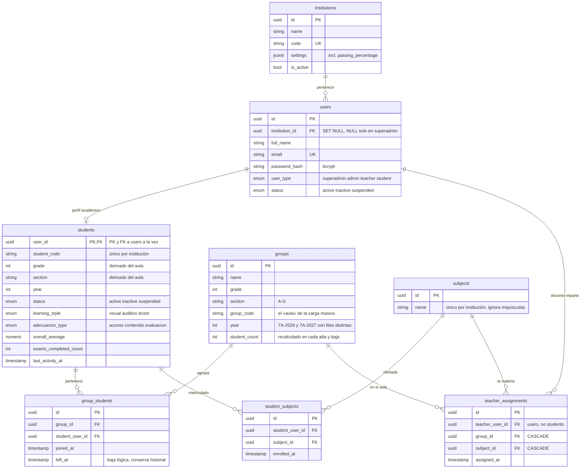

### 1.3 Evaluación

Del examen a la opción marcada. Es la cadena que cascadea entera al borrar una materia.

> **`created_by_teacher_id` es autoría, no permisos.** Registra quién redactó el examen y
> sirve para conservarlo cuando el docente se va (`SET NULL`). **No** decide a qué
> estudiantes ve ese docente: eso sale de `teacher_assignments` (§1.2). Hasta el 08/08/2026
> ambas cosas eran la misma, y era un problema — bastaba dirigir un borrador a un grupo
> ajeno para ganar acceso a su alumnado. Hoy `exam_targets` solo acepta grupos donde el
> autor tenga asignación **en la materia del examen**.

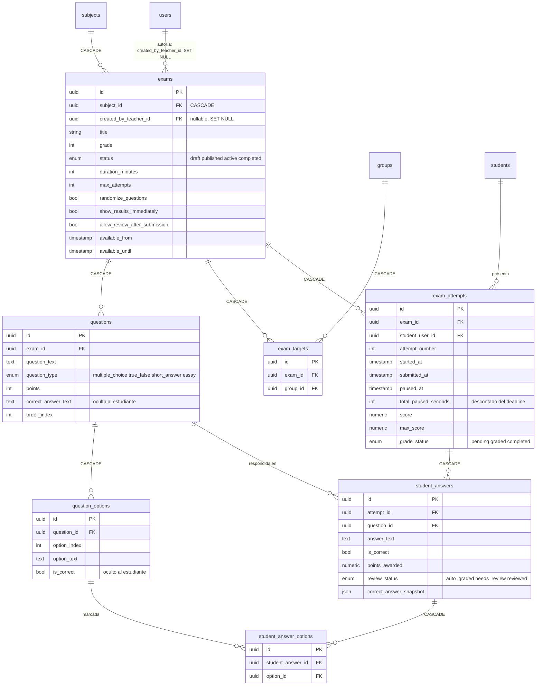

### 1.4 Seguimiento, tutor IA y apoyo

Lo que se deriva de la evaluación —el dominio por materia y las recomendaciones— más el
material de estudio y el calendario.

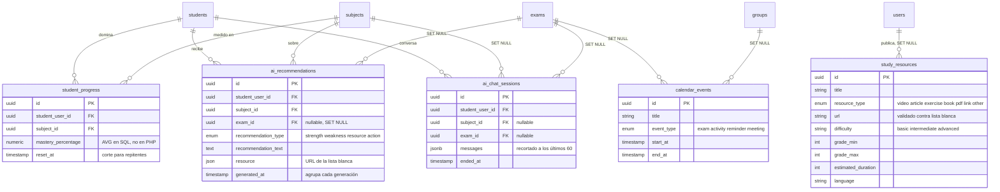

### Seis decisiones del modelo que conviene saber leer

| Decisión | Dónde se ve | Por qué |
|---|---|---|
| **`students.user_id` es PK y FK a la vez** | `students` | Un estudiante *es* un usuario con perfil académico, no una entidad paralela. Las 6 relaciones del dominio estudiante apuntan a `students(user_id)`, no a `users(id)`: así la base rechaza un intento de examen a nombre de un docente |
| **`exams.created_by_teacher_id` es *nullable* con `SET NULL`** | `users → exams` | Permite dar de baja a un docente sin perder los exámenes que dejó al centro. Con `NOT NULL` habría sido imposible borrarlo |
| **`exams.subject_id` es `CASCADE`** | `subjects → exams` | Eliminar una materia elimina su contenido académico. Es destructivo a propósito y en cadena: materia → exámenes → preguntas → intentos → respuestas |
| **`group_students.left_at`** | `group_students` | La baja de un grupo es **lógica**: la fila se conserva como historial académico. Es el patrón que conviene extender a materias y grupos |
| **`teacher_assignments` existe como tabla, y no como inferencia** | `users → teacher_assignments → groups` | El permiso del docente es un **dato que crea el administrador**, no algo que se deduzca de lo que el docente hizo. Mientras se derivaba de la autoría del examen, el propio docente podía ampliarlo. La tabla nació vacía a propósito: al desplegar, nadie ve a nadie hasta que el admin asigne |
| **`students.student_code` es único *por institución*** | `students` | Es un identificador **interno de cada centro**, no de la plataforma: dos colegios pueden numerar «EST-0001» cada uno. La constraint era global hasta el 08/08/2026 y lo impedía |

---

## 2. Aislamiento multi-tenant

Cada fila del dominio lleva `institution_id`. **Las 19 columnas tienen clave foránea**, y
todas cascadean menos una.

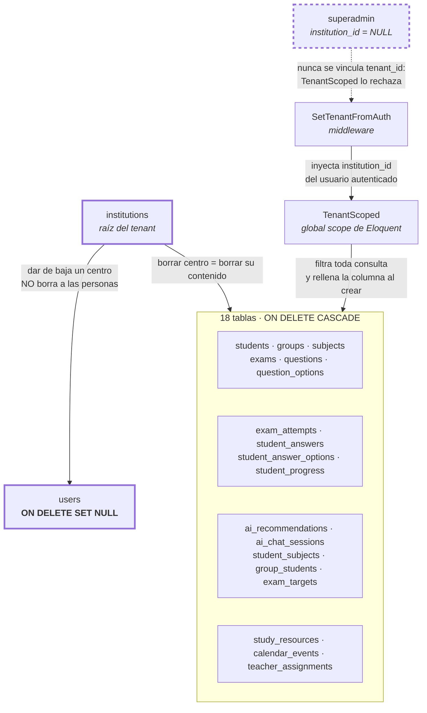

**El aislamiento vive en dos capas, y esa redundancia es deliberada.** `TenantScoped` filtra
en la aplicación — si detecta contexto HTTP sin `institution_id`, lanza `RuntimeException` en
vez de devolver datos de más. Las claves foráneas lo respaldan en la base: sin ellas era
posible escribir un `institution_id` de una institución inexistente y romper el aislamiento
por debajo del ORM.

**El superadmin es la excepción, y por omisión en vez de por permiso.** Es el operador de la
plataforma —da de alta centros y a sus administradores— y no pertenece a ninguna institución:
su `institution_id` es `NULL`. Eso significa que `SetTenantFromAuth` nunca llega a vincular un
`tenant_id`, así que **toda** consulta a un modelo con `TenantScoped` falla para él. No es una
regla de autorización que un controlador nuevo pueda olvidarse de aplicar: aunque una ruta
académica se abriera a su rol por descuido, la consulta no devolvería datos igualmente.

Ese rol nació el 08/08/2026 para cerrar un fallo concreto: `GET /api/institutions` estaba
abierto a cualquier `admin` y **no filtraba por institución**, de modo que el administrador de
un centro listaba todos los centros del SaaS. Hoy el admin de institución no tiene ninguna
ruta hacia `/api/institutions`; gestiona lo suyo por `/api/system/config`.

---

## 3. Diagrama de clases

16 modelos Eloquent: las 15 entidades más `StudentSubject`. Los 3 pivotes restantes
(`group_students`, `exam_targets`, `student_answer_options`) se manipulan por *query builder*
y no tienen modelo.

Va en tres vistas por la misma razón que el ERD. La §3.1 incluye los *traits*, que son lo que
no se ve en el esquema y sostiene la seguridad por rol.

### 3.1 Personas, estructura y los traits de seguridad

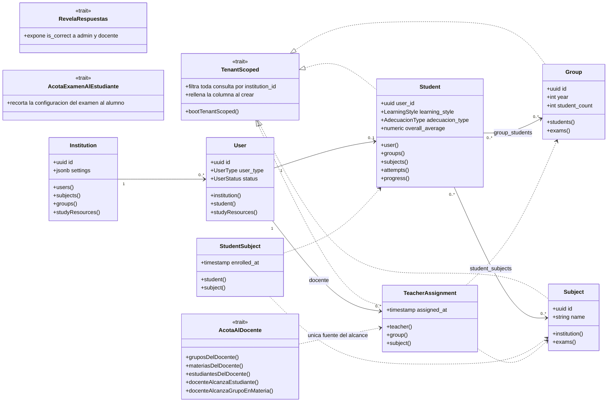

**`AcotaAlDocente` es el trait que hay que mirar si se añade un endpoint.** Resuelve «mis
estudiantes» en un solo sitio, y existe precisamente porque la versión anterior de esa regla
estaba copiada a mano en seis controladores —y **faltaba en otros cuatro**, que por eso
servían el historial completo de cualquier alumno a cualquier docente—. Lo consumen
`StudentController`, `StudentProgressController`, `ReportController`, `AnalyticsController`,
`GroupController`, `StudentSubjectController`, `AiRecommendationController`, `ExamController`
y `ReportStrategyService`.

### 3.2 Evaluación

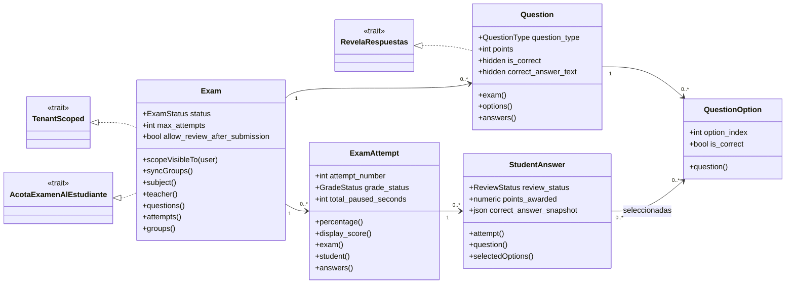

### 3.3 Seguimiento, IA y apoyo

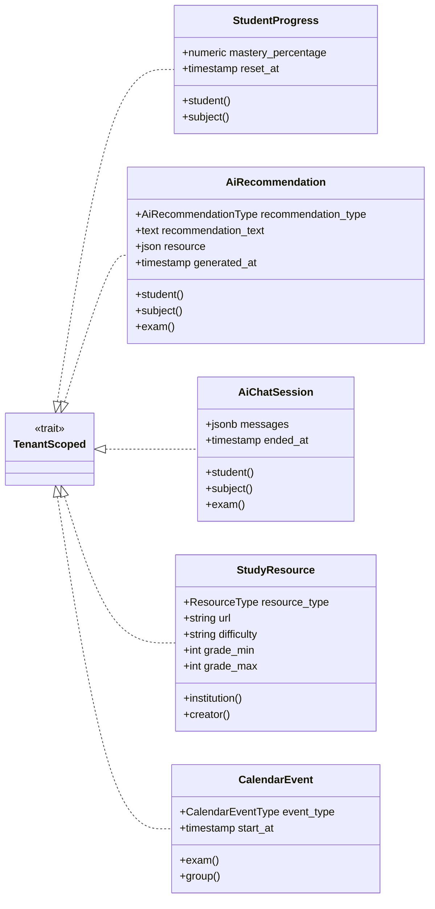

Los tres *traits* son lo que no se ve en el esquema y sostiene la seguridad por rol:
`RevelaRespuestas` y `AcotaExamenAlEstudiante` deciden **qué campos ve cada rol** sobre las
mismas filas, y `Exam::scopeVisibleTo()` centraliza qué exámenes puede ver un alumno —
activo, dentro de ventana y asignado a sus grupos.


---

## 4. Arquitectura del backend

API REST pura: **el backend no sirve HTML en ninguna ruta de la API**. La única capa de
presentación son las vistas Blade del correo y del formulario de contraseña.

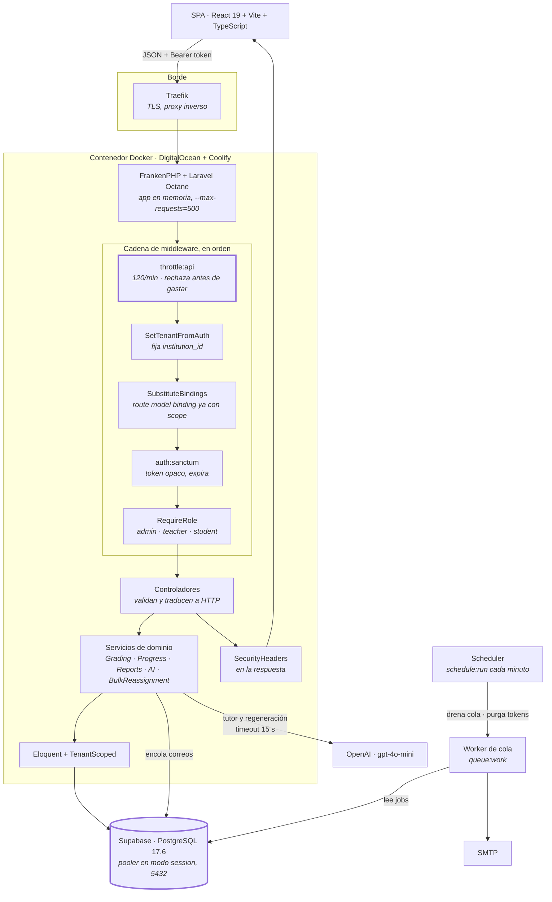

**Por qué el orden del middleware importa.** `throttle:api` va el primero a propósito: rechaza
el exceso *antes* de resolver tenant, autenticación o modelos, que es donde está el coste. Y
`SetTenantFromAuth` va antes de `SubstituteBindings` para que el *route model binding* ya
resuelva con el scope de institución activo — si no, un `{exam}` de otro centro se resolvería
y solo fallaría después.

**El cuello de botella real es el worker bloqueado.** Cada llamada a OpenAI retiene un worker
de Octane mientras dura, por eso el timeout está acotado a 15 s y hay un limitador global por
institución (`ai-global`, 120/min) además del límite por usuario. Análisis completo en
[`ANALISIS_CONCURRENCIA.md`](ANALISIS_CONCURRENCIA.md).

---

## 5. Flujo de autenticación

Hay **dos vías de alta**, y la diferencia no es cosmética: quién define la contraseña decide
si la cuenta nace utilizable.

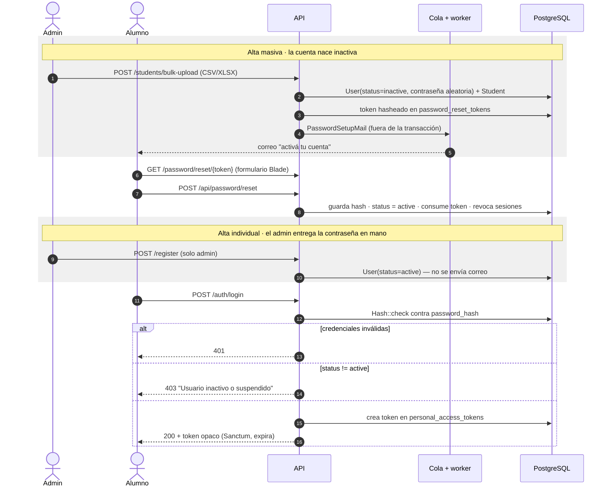

**Tres reglas que sostienen el flujo:**

- `/password/forgot` responde a cuentas `active` **e** `inactive`, nunca a `suspended`. Sin
  eso, quien perdiera el correo de alta quedaba bloqueado para siempre; y una cuenta suspendida
  la bloqueó un administrador a propósito.
- El correo se elige según el estado: a quien nunca tuvo contraseña no se le habla de
  *recuperarla*.
- **Solo se activa desde `inactive`.** Un reset sobre una cuenta `suspended` cambia la
  contraseña pero no la reactiva.

> ⚠️ Los tokens son **opacos** contra `personal_access_tokens`, no JWT. El informe dice JWT en
> dos sitios; es una de las correcciones de `ANALISIS_MODELO_DATOS_TFG.md` §9.1.

---

## 6. Flujo de examen

### 6.1 Estados del examen

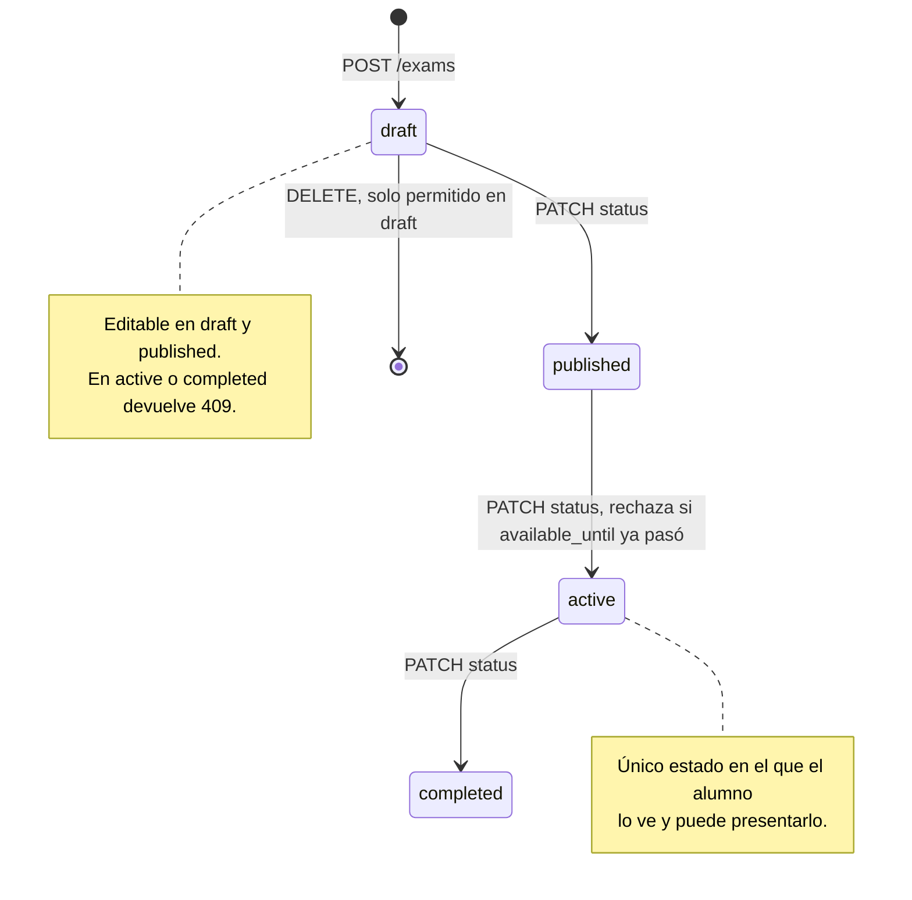

### 6.2 Ciclo de vida del intento

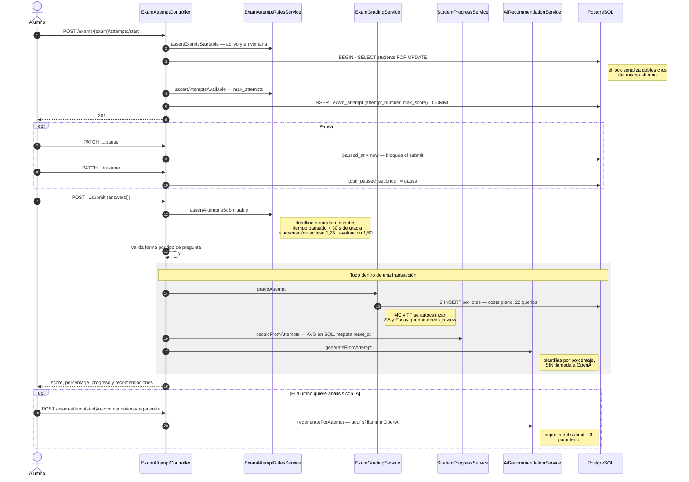

> ⚠️ **La recomendación del submit no la escribe la IA.** `generateFromAttempt` es un
> `if/elseif/else` sobre el porcentaje con textos fijos; OpenAI solo interviene si el alumno
> pide regenerar. Es deliberado —una llamada de segundos dentro de la transacción ataría un
> worker justo en el pico de concurrencia, cuando todos entregan a la vez—, pero **el informe
> lo describe al revés**: ver `ESTADO_Y_PENDIENTES.md` §3.6 nº 1.

---

## 7. Flujo del tutor IA

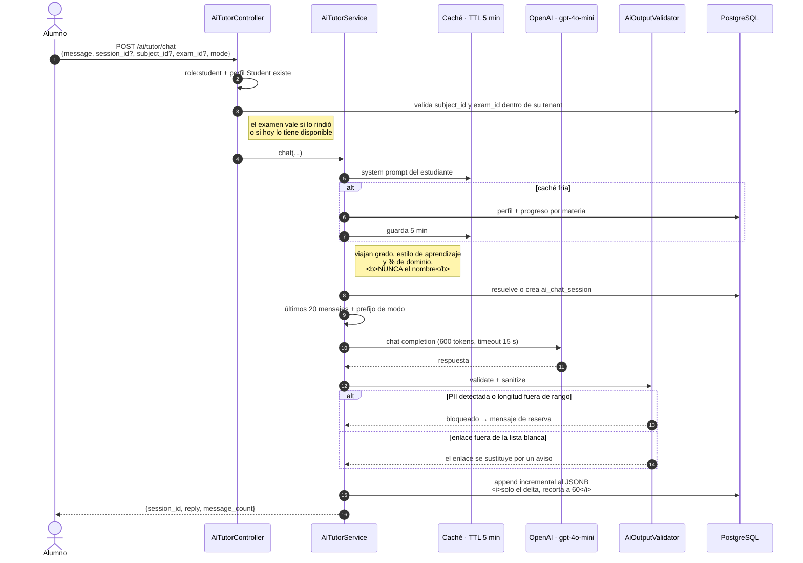

### La frontera de privacidad, que es lo que más se pregunta

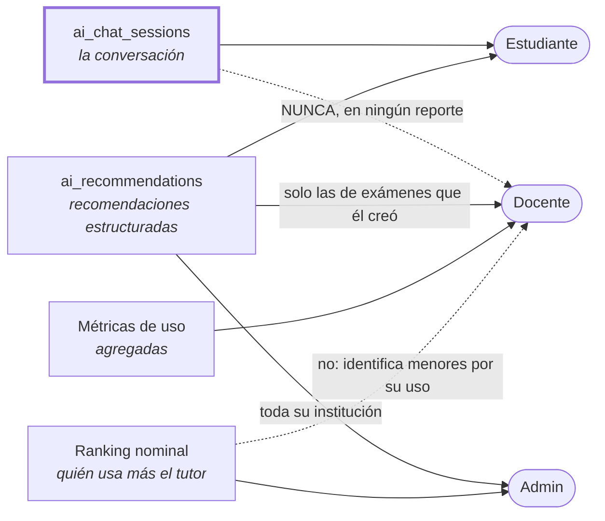

**La frontera no es alumno/docente, sino conversación/recomendación.** El informe se
contradice en este punto —promete que el docente no verá mensajes individuales y a la vez le
pide seguimiento pedagógico—, y esta lectura resuelve las dos cosas: el docente nunca ve un
mensaje del chat, y el seguimiento se apoya en las recomendaciones, que es el artefacto que
el propio informe llama *pedagógico*. Fijado como prueba en
`TutorStrategiesTest::test_chat_history_never_appears_in_the_strategies_report`.

---

## 8. Diagrama de casos de uso

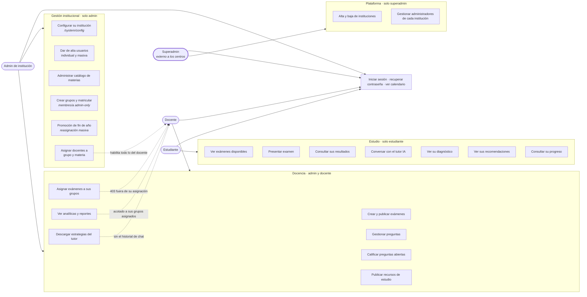

**Tres precisiones que el informe no recoge:**

- El enum `UserType` tiene **cuatro** roles, no tres, y el cuarto es **`superadmin`**, no el
  `parent` que figuraba antes: ese se retiró el 08/08/2026 tras comprobar que no tenía rutas
  ni una sola fila real. El superadmin es **externo a las instituciones** y su alcance se
  agota en dos CRUD: instituciones y sus administradores.
- El docente no es un admin recortado, **y su alcance no se lo da él**. Lo fija el
  administrador en `teacher_assignments`; fuera de sus grupos asignados no ve nada — ni
  estudiantes, ni resultados, ni recomendaciones, ni estrategias— y ni siquiera puede dirigir
  un examen a un grupo ajeno. La membresía de los grupos también es admin-only, para que no
  pueda ampliarse el alcance metiendo alumnos en un grupo suyo.
- El administrador de institución **no ve el catálogo de instituciones**. Su propio centro lo
  configura por `/api/system/config`.

---

## 9. Diagrama de proceso: el ciclo académico

El proceso completo de un curso, desde la matrícula hasta la promoción del año siguiente.

```mermaid
flowchart TB
    START(["Inicio de curso"])

    A["Admin crea las aulas del año<br/><i>llevan year: 7A-2026 ≠ 7A-2027</i>"]
    A2["Admin asigna docentes<br/><i>teacher_assignments: grupo + materia</i>"]
    B["Alta de estudiantes<br/><i>la carga masiva exige columna «aula»<br/>y matricula en group_students</i>"]
    C["Alumno activa su cuenta<br/><i>define contraseña</i>"]
    D["Matrícula en materias<br/><i>student_subjects</i>"]

    E["Docente crea examen diagnóstico<br/><i>draft</i>"]
    F["Añade preguntas y opciones"]
    G["Asigna a sus grupos<br/><i>exam_targets · 403 si no los tiene</i>"]
    H["Publica y activa"]

    I["Alumno presenta el examen"]
    J["Corrección automática<br/><i>MC y TF</i>"]
    K{"¿Hay preguntas<br/>abiertas?"}
    L["Docente califica a mano<br/><i>needs_review → reviewed</i>"]
    M["Recalcular dominio por materia<br/><i>student_progress</i>"]
    N["Recomendaciones del tutor"]

    O["Reportes y analíticas<br/><i>agregados en un solo SELECT</i>"]
    P["Alumno consulta al tutor IA"]

    Q{"Fin de curso:<br/>¿promovido?"}
    R["Reasignar al grupo<br/>del grado siguiente"]
    S["Reasignar al mismo grado<br/>del año nuevo"]
    T["Resetear progreso<br/><i>marca reset_at</i>"]
    END(["Curso siguiente"])

    START --> A --> A2 --> B --> C --> D
    D --> E --> F --> G --> H
    H --> I --> J --> K
    K -->|sí| L --> M
    K -->|no| M
    M --> N --> O
    N --> P
    P --> O
    O --> Q
    Q -->|promovido| R --> END
    Q -->|repitente| S --> T --> END

    style Q stroke-width:3px
    style T stroke-width:3px
    style A2 stroke-width:3px
```

**Los dos primeros pasos son nuevos y bloquean todo lo demás.** Sin `teacher_assignments` el
docente no ve a ningún estudiante —la tabla nace vacía a propósito—, y sin la columna `aula`
en la carga masiva el alumno queda con etiqueta de sección pero sin matrícula, que en la
práctica lo hace invisible: no lo ve ningún docente, no recibe exámenes y no sale en informes.
El aula tiene que existir antes: el archivo **no crea grupos**, para que un typo en el código
no genere un aula fantasma con un alumno dentro.

Un matiz del traslado: volver a subir la fila de un estudiante con otra aula lo **mueve**,
cerrando la matrícula anterior con `left_at` en vez de borrarla. Es la única vía por la que un
alumno cambia de aula, y cambia también qué docente pasa a ver su expediente — por eso la
respuesta del bulk informa de `reasignados` aparte de `matriculados`.

**El paso que menos se ve y más importa es el reseteo.** `recalcFromAttempts` promedia *todos*
los intentos enviados y se dispara en cada entrega y en cada revisión de respuesta, así que
poner el progreso a cero sin más se desharía solo en el siguiente examen. Por eso
`student_progress.reset_at` marca un **corte temporal** que el recálculo respeta: los intentos
anteriores dejan de contar para el dominio actual, pero **no se borran** — el historial
académico queda íntegro.

El orden de la promoción también importa: primero se mueve a los repitentes por lista
explícita, y después al resto con `from_group_id`, que a esas alturas ya solo devuelve a los
promovidos. Así no hace falta ningún parámetro de exclusión.

---

## Qué figuras del informe cubre cada diagrama

| Figura del informe | Aquí | Estado |
|---|---|---|
| — *(no existe)* | §1 Modelo entidad-relación | **Nueva.** El informe no tiene ERD pese a tener 20 tablas y 51 FK |
| — *(no existe)* | §2 Aislamiento multi-tenant | **Nueva.** Es la decisión de arquitectura más transversal del sistema, y ahora incluye la frontera superadmin/institución |
| Figura 2 · Diagrama de clases | §3 | Rehacer: faltan `AiChatSession`, `StudentSubject` y `TeacherAssignment` |
| Figura 7 y 8 · Arquitectura | §4 | Rehacer: el informe describe Node.js y Next.js, que no existen |
| Figura 6 · Flujo de autenticación | §5 | Rehacer: es Sanctum con tokens opacos, no JWT |
| Figura 4 · Flujo de examen | §6 | Rehacer: añadir pausa/reanudación y adecuación curricular |
| Figura 10 · Flujo de ChatBot | §7 | Rehacer: añadir modos, validación de salida y frontera de privacidad |
| Figura 9 · Casos de uso | §8 | Rehacer: son cuatro roles, no tres, y el cuarto es `superadmin` — externo a los centros — no el `parent` retirado |
| Figura 3 · Diagrama de proceso | §9 | Rehacer: añadir el ciclo completo con repitentes, la asignación de docentes y el aula obligatoria en la carga masiva |
